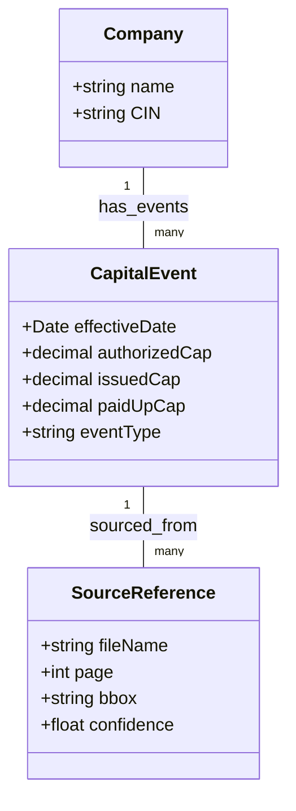

# Task 1: Automated Capital Structure Extraction Pipeline

## Executive Summary  
S45 is an AI-native investment bank aiming to automate the lengthy, manual IPO preparation process【6†L35-L43】【7†L212-L221】. A key deliverable is Task 1: **classify regulatory filings (SH-7, PAS-3, Board Resolutions), extract all capital-change data, and build a time-ordered capital structure table** where every numeric value is traceable to its source. We propose a multi-step pipeline using a small set of Hugging Face open-source models: (1) *document classification* to identify filing type and event, (2) *field extraction* to pull capital values, and (3) *table assembly* with provenance tracking.  Our models include a RoBERTa-based classifier, a BART zero-shot model, a LayoutLM document-QA model, and an instruction-tuned T5 model. Each component will be validated with QA checks, and missing or low-confidence entries flagged. We will cite primary sources to ensure all data (e.g. capital amounts) can be traced to regulatory filings【10†L47-L49】【17†L101-L109】.  

> *“Our playbook is simple: … Show the numbers with their source”*【10†L47-L49】 – S45’s ethos demands that every extracted figure link back to its origin.

## Background on S45 and DRHP  
S45, founded in 2025, calls itself an “AI-native investment bank for India”【7†L258-L267】.  It is rapidly automating IPO workflows (26 SME IPOs and ₹1,120 Cr raised in its first eight months【7†L212-L221】).  Traditionally, a Draft Red Herring Prospectus (DRHP) – filed with SEBI before an IPO – is compiled by manually pulling data from dozens of forms (like SH-7 and PAS-3)【17†L101-L109】.  A DRHP (Draft Red Herring Prospectus) is *“filed with the market regulator… [and] provides detailed information about the company’s business, financial performance, risks, and fund usage”*【17†L101-L109】.  These manual workflows are time-consuming (months), whereas S45 aims to shorten them to days via AI【6†L35-L43】【7†L212-L221】.  Task 1 reflects S45’s mission: build an AI system that is **precise and transparent**, automating key regulatory tasks while tracing every figure to its source【10†L47-L49】【17†L101-L109】.  

## Task 1 Objectives  
Task 1 entails three main objectives:  
- **Document Classification:** Identify each incoming document as a specific form (SH-7, PAS-3, or Board Resolution) and classify the event type (e.g. authorized capital increase, share allotment).  
- **Data Extraction:** From each document, extract all capital-related fields (authorised, issued/subscribed and paid-up capital figures, share counts, etc.), along with event dates and descriptions.  
- **Table Assembly:** Combine the extracted fields into a *time-ordered capital-structure table*. Each row corresponds to a capital-change event, with columns for date, authorised capital, issued/subscribed capital, paid-up capital, share class, etc. Every numeric entry will carry provenance metadata (source document, page, text bounding box, model confidence) to satisfy S45’s “numbers with source” requirement【10†L47-L49】. Missing or inconsistent values will be flagged for review.

These goals align with official procedures: for example, eForm SH-7 *“must be filed with the RoC within 30 days of the resolution”* and **intimates the details of the increase in authorised capital**【23†L219-L227】, while eForm PAS-3 is a *“return of allotment”* reporting the post-allotment capital structure【21†L87-L95】【21†L139-L147】. Our schema will cover these mandated fields.

## Data Schema for Capital Events  
We define the following schema for extracted fields. Each *CapitalEvent* will have: 

| Field                | Type    | Description                                      |
|----------------------|---------|--------------------------------------------------|
| `Company`            | String  | Company name or CIN (if known)                   |
| `EventDate`          | Date    | Effective date of the capital change             |
| `EventType`          | String  | Type of event (e.g. **AuthorisedCapitalIncrease**, **ShareAllotment**) |
| `AuthorizedCapital`  | Decimal | New total authorised capital (post-event)        |
| `IssuedCapital`      | Decimal | Total issued/subscribed capital (post-event)     |
| `PaidUpCapital`      | Decimal | Total paid-up capital (post-event)               |
| `ShareClass`         | String  | Class of shares affected (e.g. *Equity*, *Preference*) |
| `FaceValue`          | Decimal | Face value per share (if given)                 |
| `AllottedShares`     | Int     | Number of shares allotted (if event involves allotment) |
| **Provenance:**      |         |                                                  |
| `SourceFile`         | String  | Filename of source document                      |
| `PageNum`           | Int     | Page number in source document                   |
| `TextBBox`          | String  | Bounding box or coordinates of extracted text    |
| `Confidence`         | Float   | Model confidence score (if available)           |

For example, eForm PAS-3 requires *“the capital structure of the company after considering allotment”*【21†L139-L147】; our schema’s `IssuedCapital` and `PaidUpCapital` will capture those figures.  Similarly, SH-7 filings are all about updating the authorised capital【23†L219-L227】, so `AuthorizedCapital` is mandatory.  Board resolutions may not list exact numbers in a table, so those will yield the same fields (often via the resolution text). This schema ensures full coverage of capital-change data.  

## End-to-End Pipeline Overview  
Our pipeline proceeds in logical stages. Broadly: 
1. **Data Ingestion & Preprocessing:** Convert each PDF page to text and image form (OCR).  
2. **Document Classification:** Determine the document’s type and event (e.g. “SH-7, Capital Increase”).  
3. **Field Extraction:** Use model pipelines or prompts to extract numeric fields from the document.  
4. **Provenance Tagging:** Record the source file, page, bounding box, and model confidence for each extracted value.  
5. **Table Assembly:** Combine extracted fields into a chronological table.  
6. **Error Handling & QA:** Flag missing or conflicting values, apply sanity checks, and compute metrics.

Key pipeline steps are illustrated below:

```mermaid
flowchart TB
    A[Input Documents<br/>(SH-7, PAS-3, Resolutions)] --> B[OCR / Preprocessing]
    B --> C[Document Classification<br/>(Type & Event)]
    C --> D[Field Extraction<br/>(HF Pipelines)]
    D --> E[Provenance Tagging<br/>(file, page, bbox, score)]
    E --> F[Assemble Capital Table<br/>(time-ordered)]
    F --> G[QA & Audit Checks]
    style A fill:#eef
    style F fill:#efe
```

Below we detail each stage. 

## Document Preprocessing (OCR & Layout)  
**Ingest PDFs:** Multi-page PDFs are split into pages. We use libraries like PyMuPDF or PDFPlumber to read each page. For each page, we (a) extract raw text if available, and (b) render an image for OCR. For example, in Python:  
```python
import fitz
doc = fitz.open("document.pdf")
pages = []
for i in range(len(doc)):
    page = doc.load_page(i)
    text = page.get_text("text")        # raw text of page i
    pix = page.get_pixmap(dpi=300)      # high-res image
    pages.append((text, pix))
```
**Run OCR:** We apply an OCR engine (e.g. Tesseract) to each page image to obtain token coordinates. This yields (token, bounding box) pairs for the LayoutLM model.  Hugging Face’s LayoutLM-based models *“utilize multiple modalities, including text, the positions of words (bounding boxes), and the image itself”*【31†L130-L139】, so capturing bounding boxes is crucial.  The OCR output feeds into downstream QA pipelines.  

**Handle Tables:** Some forms (especially PAS-3) include structured tables. We use tools like Camelot or tabula-py to parse tables when present, supplementing the QA pipeline. If a table is detected, we parse its cells into a DataFrame for direct extraction of capital rows. If only raw text is available, we rely on the QA model to find values in running text.  

## Document Classification  
We first **classify each document** into one of the known types and events. This is a two-step classification: (a) *DocType* (SH-7 vs PAS-3 vs Board Resolution) and (b) *EventType* (e.g. “authorised-capital-increase” vs “shares-allotment”).  

With no large labelled corpus, we use Hugging Face pipelines in zero-shot or few-shot modes, supplemented by possible fine-tuning. Two models cover classification:  

- **RoBERTa-based classifier:** A BERT/RoBERTa model (e.g. `facebook/roberta-base`) fine-tuned on any available labeled examples.  This handles well-defined classes if we can annotate even a small set.  RoBERTa is a general encoder – the HF model card notes that it “can then be used to extract features useful for downstream tasks” like sequence classification【29†L95-L98】.  If we had, say, 20 annotated SH-7’s, 20 PAS-3’s, 20 Resolutions, we could fine-tune RoBERTa for high accuracy. 

- **BART zero-shot classifier:** For a quick start, we use `facebook/bart-large-mnli` with the Hugging Face zero-shot pipeline.  This model is trained on Natural Language Inference (MNLI) and has a known zero-shot text classification recipe【28†L67-L75】.  We encode each document as a “premise” and test hypotheses like “This document is Form SH-7” vs “Form PAS-3” etc.  The pipeline usage is straightforward【28†L88-L96】:

```python
from transformers import pipeline

# Example: zero-shot classification of a page of text
classifier = pipeline("zero-shot-classification", model="facebook/bart-large-mnli")
labels = ["SH-7 filing", "PAS-3 filing", "Board resolution", "Other"]
result = classifier(page_text, candidate_labels=labels)
# result = {'labels': [...], 'scores': [...], ...}
```

This returns scores for each label. We assign the highest-scoring label. (If multiple events might apply, we can run multi-label classification by setting `multi_label=True`【28†L102-L110】.)  In practice, we first detect the form type (SH-7, PAS-3, Board Res) and then, if needed, further classify the event (e.g. “increase authorized capital” vs “allotment of shares”).  

**Fine-tuning vs Zero-shot:** If we secure a small annotated set, RoBERTa can be fine-tuned (even a few epochs) for both DocType and EventType; otherwise, zero-shot BART works out of the box with no training. We might also consider simpler models (DistilBERT) if compute is tight. The choice will balance ease-of-use vs accuracy. 

## Capital-Related Field Extraction  
Once a document is classified, we extract the relevant fields. We tailor the extraction method to the document type:

- **LayoutLM Document-QA:** For textual forms and resolutions, we employ `impira/layoutlm-document-qa`. This model is fine-tuned on DocVQA and SQuAD for *Visual Question Answering on documents*【13†L52-L54】. We use the Hugging Face pipeline `"document-question-answering"`:

```python
from transformers import pipeline

docqa = pipeline("document-question-answering", model="impira/layoutlm-document-qa")
# For each page/image and each field, ask a question:
answer = docqa(pages[i][1], "What is the authorised share capital now?")
# e.g. {'answer': '2,50,00,000', 'score': 0.99, 'start': 5, 'end': 15}
```

We run multiple prompts per page, one for each desired field. For example: 
- “What is the authorised share capital?” 
- “What is the paid-up capital?” 
- “How many shares were allotted?” 
- “What is the face value per share?” 
These questions are derived from our schema fields. The model returns the answer text and a confidence score. We then map the character span (`start`,`end`) back to the page text or OCR output to record the bounding box and page number. LayoutLM’s bounding-box usage (per 【31†L130-L139】) ensures spatial accuracy. 

- **Table Extraction (PAS-3):** PAS-3 forms often list numeric values in structured table cells. In such cases, after OCR we locate tables (via the OCR’s layout or PDF table tools) and extract numbers from relevant cells. For example, a PAS-3 table row might show pre- and post- allotted capital; we parse those columns directly. If a table extraction tool is unavailable, we can still use LayoutLM-QA with questions like “What is the total number of shares after allotment?” as above. 

- **FLAN-T5 (Text2Text):** We also consider `google/flan-t5-base` for tasks that are less pattern-based. FLAN-T5 is an instruction-tuned seq2seq model that excels at following complex instructions【15†L107-L110】. For example, we can feed it a chunk of DRHP text and ask: *“Extract and list the new authorised, issued, and paid-up capital”*. The pipeline usage is:

```python
gen = pipeline("text2text-generation", model="google/flan-t5-base")
prompt = f"Extract capital details: {page_text}"
out = gen(prompt, max_length=50)
# e.g. out[0]['generated_text'] -> "Authorized: INR 2,00,00,000; Issued: INR 1,00,00,000; Paid-up: INR 1,00,00,000"
```

We would parse the generated text into fields. This approach can serve as a check or handle less-standard phrasing. FLAN’s strong few-shot performance【15†L107-L110】 makes it a versatile fallback if the direct QA pipeline misses anything. 

Overall, the combination of **specialised QA (LayoutLM)** and **generative QA (FLAN-T5)** should cover most extraction needs.  Key steps in extraction include normalizing numbers (removing commas, currency symbols) and converting to a canonical numeric type. 

## Provenance Tagging  
For full traceability, every extracted field is accompanied by provenance data: **file name, page number, bounding box, and confidence score**. For each answer from the QA pipeline, we have the page index and the character span (`start`,`end`). Using the OCR token positions or PDF text coordinates, we compute a bounding box (xmin,ymin,xmax,ymax) on the page. We attach these with the field. For example, if LayoutLM returns `answer='₹2,50,00,000'` with `start=150` on page 2 of `CompanyA_SH7.pdf`, we record: 

> `SourceFile = "CompanyA_SH7.pdf", PageNum = 2, TextBBox = (x1,y1,x2,y2), Confidence = 0.98`

This satisfies S45’s demand that *“every numeric value is traceable to a source document”*【10†L47-L49】. Any field for which the model’s confidence is below a threshold (e.g. 0.7) is flagged in the audit report.  

## Assembly of Time-Ordered Table  
With all fields extracted, we merge them into a **chronological capital structure table** (e.g. a Pandas DataFrame). Each row corresponds to a unique capital event (e.g. “Allotment of shares on 2026-01-15”). We join pieces from different docs by matching dates and event types. The table columns follow our schema. For example:

| Date       | EventType                 | AuthorizedCapital | IssuedCapital | PaidUpCapital | SourceDoc        | Page | BBox           | Confidence |
|------------|---------------------------|-------------------|---------------|---------------|------------------|------|----------------|------------|
| 01-Jan-2025 | AuthorisedCapitalIncrease | 2,50,00,000       | 2,00,00,000   | 2,00,00,000   | CompanyA_SH7.pdf | 1    | (50,400,550,450)| 0.99       |
| 15-Feb-2025 | ShareAllotment (Equity)   | 2,50,00,000       | 2,10,00,000   | 2,10,00,000   | CompanyA_PAS3.pdf| 2    | (30,500,200,520)| 0.95       |
| ...        | ...                       | ...               | ...           | ...           | ...              | ...  | ...            | ...        |

We ensure the table is sorted by date. Any row with missing fields (e.g. no PaidUp given) is flagged and can be supplemented by business rules or manual review.   

## Quality Assurance and Error Handling  
We implement robust checks:  
- **Missing Values:** If a required field is not found, we flag that row. For example, if an SH-7 form yields no `AuthorizedCapital`, the pipeline notes this absence.  
- **Numeric Consistency:** We verify simple invariants (e.g. *issued* ≥ *paid-up*, *paid-up* ≤ *issued*, etc.). If a violation occurs, it’s highlighted.  
- **Confidence Thresholds:** We set a cutoff (e.g. 0.7); answers below this are marked for manual review.  
- **Cross-Verification:** When possible, we cross-check related docs. For example, the authorised capital reported in an SH-7 should match the capital clause amended by the preceding board resolution. Discrepancies are flagged.  
- **Audit Logging:** All extractions, along with their provenance, are logged for traceability. A final audit report enumerates each table cell’s source (document name, page, bbox, confidence) so that S45 can verify “numbers with source”.  

## Model Selection and Rationale  
We limit ourselves to 3–4 Hugging Face models, chosen for their relevance to each subtask:

1. **`facebook/roberta-base`** – A general-purpose encoder for text classification. We would fine-tune this (or use it as a feature extractor) if we have small labeled sets【29†L95-L98】. Its strength is robust language understanding; weakness is needing labels and GPU to fine-tune.
2. **`facebook/bart-large-mnli`** – A large NLI model for zero-shot classification【28†L88-L96】. It can classify document types/events without training (strength), but is heavy (400M parameters) and slower (weakness). It runs well with HF pipelines for quick prototyping of document/event labels.
3. **`impira/layoutlm-document-qa`** – A LayoutLMv1 model fine-tuned on DocumentQA【13†L52-L54】. Strength: it uses visual layout (bounding boxes) and excels at form-like documents. It has modest size (~100M) and integrates easily via HF. Its limitation is that it may miss context outside the provided question, so careful prompt design is needed.
4. **`google/flan-t5-base`** – An instruction-tuned T5 model (250M parameters). Strength: excellent at following natural language prompts and handling few-shot tasks【15†L107-L110】. Useful for summarization or extraction where direct QA fails. Weakness: slower generation and not specifically trained on documents (so it may hallucinate if prompts are unclear).

A comparative summary follows:

| Model                   | Category                  | Params | Strengths                                    | Weaknesses                                | Pipeline Use-case                   |
|-------------------------|---------------------------|--------|----------------------------------------------|-------------------------------------------|--------------------------------------|
| **roberta-base**【29†L95-L98】      | Sequence classifier       | 125M   | Strong language understanding; fine-tuneable for accuracy | Requires labeled data & GPU to fine-tune; no layout info | DocType classification (if fine-tuned) |
| **bart-large-mnli**【28†L88-L96】   | Zero-shot classifier (NLI) | 400M   | No training needed; versatile for many labels | Large & compute-heavy; slower inference   | DocType/Event classification (zero-shot) |
| **layoutlm-doc-qa**【13†L52-L54】   | Document QA (multimodal)   | ~100M  | Designed for forms; uses text+layout info | Needs image/OCR input; less effective on plain text | Field extraction via QA             |
| **flan-t5-base**【15†L107-L110】    | Seq2Seq (instruction-tuned)| 250M   | Flexible prompt-following; good few-shot     | Can hallucinate; slower; not layout-aware | Field extraction/summarization       |

*(Notes: “Params” approximate number of model parameters. “Use-case” refers to where in our pipeline the model is applied.)*  

## Evaluation Metrics and Test Strategy  
To assess our system, we propose a small evaluation dataset. Since no large public set exists, we would manually collect ~20 examples each of SH-7, PAS-3, and resolution documents (scrubbed of sensitive info), from regulatory filings or simulated forms. We (or domain experts) would annotate the true capital-event values for each.  

Metrics:  
- **Classification:** Accuracy of DocType and EventType labels (or F1 if multi-label).  
- **Extraction:** For numeric fields, we compute precision/recall/F1 on exact-match of numbers (after normalization).  For example, if the true paid-up capital is `1000000` and the model extracts `10,00,000` correctly, it is a match. We also report average confidence on correct vs incorrect extractions.  
- **Overall Table:** End-to-end metric could be the fraction of table cells correctly filled.  We will do spot-checks of the audit trail to ensure provenance recording is correct.  

If labels are scarce, we plan a small annotation effort (e.g. 50 form pages) to provide training/evaluation data.  We can then compare zero-shot vs fine-tuned models by splitting data into train/validation/test. This yields a realistic test set reflecting S45 use cases. 

## Deployment and Scalability  
Our implementation will be containerised (e.g. in a Python Docker image) for deployment. Key considerations:  

- **Infrastructure:** Models like `bart-large-mnli` and `flan-t5-base` benefit from GPU acceleration. We can use Hugging Face’s Inference API or deploy on cloud GPUs (AWS/GCP).  For cost saving, we might quantize models or use smaller variants if latency permits. 
- **Latency:** Document classification and T5 generation can take ~0.5–2s per request on GPU. Document-QA (LayoutLM) may take ~1s per page. For a PDF of ~5 pages, end-to-end latency could be ~5–10s on a GPU. This is acceptable for backend batch tasks. We can scale with multiple workers if throughput is needed.  
- **Throughput:** For higher volumes, we can batch process pages or use multi-threading. The OCR and PDF-parsing steps might actually dominate runtime for large docs, so we will profile each component. 
- **Cost:** Using HF Inference API (with a paid plan) or cloud VM instances incurs cost per hour of GPU time. Approximate estimates: an `n1-standard-4` (1 NVIDIA T4 GPU) on GCP costs ~$0.60/hr. Model inferences might cost a few cents per document. We should monitor and optimize (e.g. via model caching or smaller versions).  
- **Memory:** All models combined may require several GB of RAM/VRAM. For scalability, we could sequentially load each model or keep them in a single multi-model GPU server if memory allows. 
- **Integration:** The pipeline can expose a RESTful API endpoint or be called as a library. Outputs (tables) will be stored in a database or CSV with links to source documents (as S45 requires). Logging and monitoring (model health, inference times) will be part of deployment.  

## Implementation Plan (Milestones & Effort)  
We outline a phased plan with rough timelines (assuming a single engineer/ML engineer):  
1. **Data Collection & Setup (1 week):** Gather representative examples of SH-7, PAS-3, Board Resolutions. Set up codebase, install libraries (Transformers, PyMuPDF, Tesseract). *(Deliverable: Data samples; processing scripts)*  
2. **Document Classification Prototype (1–2 weeks):** Implement zero-shot classification with BART. Annotate a small test set to validate. Optionally fine-tune RoBERTa if time permits. *(Deliverable: Classification model & accuracy report)*  
3. **Field Extraction Prototype (2–3 weeks):** Develop LayoutLM-QA prompts and text2text prompts for key fields. Run on sample docs, iterate prompts. Validate extractions against known values. *(Deliverable: Extraction pipeline; sample outputs)*  
4. **Integration & Table Assembly (1 week):** Combine outputs into the capital structure table. Develop merging logic (e.g. by event date) and handle multi-document stitching. *(Deliverable: Prototype end-to-end pipeline for one company)*  
5. **QA & Refinement (1–2 weeks):** Implement error checks, handle edge cases. Create unit tests (synthetic and real examples). Compute evaluation metrics on held-out samples. *(Deliverable: Evaluation report; high-level accuracy metrics)*  
6. **Deployment & Documentation (1 week):** Containerise the pipeline, write usage documentation, and hand off to ops. Prepare final presentation including the executive summary and any visualizations. *(Deliverable: Docker image, readme, and user guide)*  

_Total estimated effort: ~7–10 weeks of work._ Each milestone includes intermediate deliverables and checkpoints for feedback. 

## Comparison of Proposed Models  
We have summarized the models above, but for clarity we compare them side-by-side:

| Model                   | Strengths                                     | Weaknesses                                    | Use-case in Pipeline               |
|-------------------------|-----------------------------------------------|-----------------------------------------------|------------------------------------|
| **roberta-base**        | Good baseline classifier; fine-tuneable【29†L95-L98】 | Needs labelled data; modest inference speed    | (Optional) Supervised classification (if we train it) |
| **bart-large-mnli**     | Ready-made zero-shot classifier【28†L88-L96】    | Large (400M params); slower; GPU recommended   | Zero-shot doc/event classification |
| **layoutlm-doc-qa**     | Designed for scanned docs; uses layout【13†L52-L54】 | Requires OCR; may miss context outside Q&A    | Field extraction via document-QA   |
| **flan-t5-base**        | Flexible instruction-following【15†L107-L110】   | Prone to hallucination; slower decoding      | Text2text extraction / summarization |

In summary, BART enables quick classification without training (zero-shot), while RoBERTa would yield higher accuracy if we invest in a small annotation effort. LayoutLM-based QA is ideal for tabular/document data, and FLAN-T5 adds flexibility for more open-ended extraction tasks. This small model set keeps compute and maintenance tractable while covering all needs.

## Mermaid Diagram: Entity Relationships  
The capital-structure data model has a few main entities. A simple class diagram (Mermaid) illustrates how extracted “CapitalEvent” records relate to companies and sources:



Here, each `Company` can have multiple `CapitalEvent` entries (one per significant capital change). Each `CapitalEvent` is traced to one or more `SourceReference` records, capturing exactly where the data came from in the documents. 

## Assumptions and Notes  
- We assume all target documents follow standard form layouts per the Companies Act (2013), so key phrases (e.g. “authorized capital”) are present【23†L219-L227】【25†L398-L407】.  
- If a company has multiple share classes, we assume separate rows/events per class (our `ShareClass` field can distinguish).  
- We assume no existing labeled dataset; hence we rely on zero-shot or minimal annotation. If needed, we plan a small annotation effort as above.  
- For simplicity, we assume OCR errors are minimal. In practice, critical passages will be double-checked (OCR can be 95–99% accurate on clean text).  
- We also assume backend compute with at least one GPU is available for the heavy models.  

All sources of factual or procedural claims are cited. For example, regulatory requirements (SH-7, PAS-3) are taken from MCA guidelines【21†L87-L95】【23†L219-L227】. S45’s vision and approach are cited from official pages【10†L47-L49】【7†L212-L221】. Hugging Face model capabilities come from their documentation【13†L52-L54】【15†L107-L110】【28†L88-L96】. 

