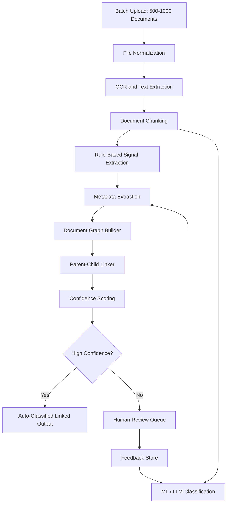
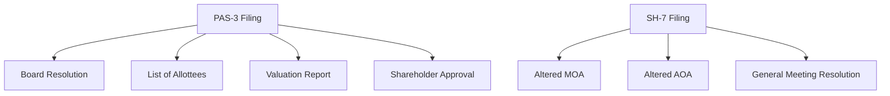

# Task 2: Design Document

## Problem 1: Document Classification and Parent-Child Linking

### 1. Problem Overview

The system must process 500-1000 uploaded finance and legal documents in a single batch, classify each document, extract key content, and correctly link related documents.

In real finance workflows, documents are not isolated files. A parent filing such as PAS-3 may include several attachments, including board resolutions, valuation reports, list of allottees, shareholder approvals, or meeting documents. These attachments are part of the same corporate event and must be linked to the parent filing rather than treated as independent events.

Supported document categories include:

- SH-7
- PAS-3
- PAS-5
- CCP Conversions
- Memorandum meetings
- Board resolutions
- Filing attachments and annexures

### 2. Goals

The system should:

- Classify each document by type.
- Extract document-level and event-level metadata.
- Identify parent-child relationships between filings and attachments.
- Link attachment documents to the correct parent filing.
- Handle 500-1000 documents per batch efficiently.
- Provide confidence scores and evidence for every classification and link.
- Send ambiguous cases to human review.

### 3. Non-Goals

The first version should not attempt to fully automate every edge case. It should avoid making low-confidence links silently. In financial document workflows, incorrect linking can be more damaging than manual review.

The system also should not rely only on a single LLM prompt. A robust production system needs rules, extraction, embeddings, classifiers, graph logic, and human feedback.

### 4. High-Level Architecture



### 5. Processing Pipeline

#### 5.1 File Normalization

Documents may arrive as native PDFs, scanned PDFs, images, DOCX files, or mixed files. Every uploaded file should be normalized into a common internal document object.

```json
{
  "document_id": "doc_001",
  "batch_id": "batch_123",
  "file_name": "PAS3_Allotment_Attachment.pdf",
  "page_count": 7,
  "source_type": "pdf",
  "text": "...",
  "pages": [
    {
      "page_number": 1,
      "text": "...",
      "ocr_confidence": 0.94
    }
  ]
}
```

The system should preserve:

- File name
- Folder path
- Upload order
- Page count
- Extracted text
- OCR confidence
- Page-level text
- File hash for duplicate detection

#### 5.2 OCR and Text Extraction

Use a hybrid extraction strategy:

| Input Type | Strategy |
|---|---|
| Native PDF | PDF text parser |
| Scanned PDF | OCR |
| Image | OCR |
| DOCX | Document parser |
| Mixed PDF | Native text extraction with OCR fallback |

The extracted text should be stored with page-level references because filings and attachments often refer to annexures, board resolutions, and supporting documents by page or section.

### 6. Classification Approach

The classification layer should use multiple signals. This is important because file names are unreliable, OCR may be noisy, and different companies may use different formats for supporting documents.

#### 6.1 Classification Signals

Use the following signals:

- Filename signals, such as `PAS-3.pdf`, `Form_SH7_signed.pdf`, or `Board Resolution for allotment.pdf`.
- Header and title signals, such as `Form PAS-3`, `Return of Allotment`, or `Form SH-7`.
- Legal phrase signals, such as `certified true copy of the resolution passed`.
- Form structure signals, such as MCA form fields, CIN fields, SRN fields, and signature blocks.
- Semantic classifier output from a trained model.
- LLM fallback for ambiguous or low-confidence cases.

#### 6.2 Classification Output

```json
{
  "document_id": "doc_001",
  "predicted_type": "PAS-3",
  "confidence": 0.97,
  "signals": {
    "filename": 0.85,
    "header_match": 1.0,
    "semantic_model": 0.96,
    "llm": 0.98
  },
  "evidence": [
    "Detected phrase: Form PAS-3",
    "Detected phrase: Return of Allotment",
    "Detected CIN field"
  ]
}
```

### 7. Metadata Extraction

After classification, extract common and type-specific metadata.

#### 7.1 Common Metadata

```json
{
  "company_name": "ABC Private Limited",
  "cin": "U12345MH2020PTC123456",
  "document_date": "2024-03-15",
  "filing_date": "2024-03-20",
  "meeting_date": "2024-03-10",
  "signatory_name": "John Doe",
  "amount": 5000000,
  "share_count": 100000
}
```

#### 7.2 PAS-3 Metadata

```json
{
  "form_type": "PAS-3",
  "allotment_date": "2024-03-15",
  "number_of_allottees": 8,
  "securities_allotted": "Equity Shares",
  "nominal_amount": 1000000,
  "premium_amount": 4000000
}
```

#### 7.3 SH-7 Metadata

```json
{
  "form_type": "SH-7",
  "change_type": "Increase in authorized share capital",
  "old_authorized_capital": 10000000,
  "new_authorized_capital": 25000000
}
```

#### 7.4 Board Resolution Metadata

```json
{
  "document_type": "Board Resolution",
  "resolution_date": "2024-03-10",
  "resolution_subject": "Approval of allotment of equity shares",
  "linked_event_hint": "PAS-3"
}
```

### 8. Parent-Child Relationship Detection

The system should model the batch as a graph. Documents are nodes, and possible relationships are edges.



#### 8.1 Parent Document Types

Likely parent documents include:

- PAS-3
- SH-7
- PAS-5
- CCP conversion filings
- Other primary event filings

#### 8.2 Child Document Types

Likely child documents include:

- Board resolutions
- Shareholder resolutions
- Memorandum meeting documents
- Valuation reports
- List of allottees
- Altered MOA or AOA
- Consent letters
- Certificates
- Annexures

#### 8.3 Linking Signals

| Signal | Example | Weight |
|---|---|---|
| Same company or CIN | Same CIN appears in parent and child | High |
| Same event date | Board meeting date close to allotment date | High |
| Explicit reference | `Attached to Form PAS-3` | Very high |
| Filename grouping | `PAS3_Attachment_1.pdf` | Medium |
| Upload folder or order | Parent followed by attachments | Medium |
| Shared amounts or share counts | Same allotment amount | High |
| Semantic similarity | Board resolution discusses allotment | Medium |
| Required attachment checklist | PAS-3 expects list of allottees | High |

#### 8.4 Link Scoring

```python
def score_link(parent, child):
    score = 0

    if parent.company_cin and parent.company_cin == child.company_cin:
        score += 30

    if abs(days_between(parent.event_date, child.document_date)) <= 30:
        score += 20

    if child.text_mentions(parent.form_type):
        score += 25

    if amounts_overlap(parent.extracted_amounts, child.extracted_amounts):
        score += 15

    if filename_similarity(parent.file_name, child.file_name) > 0.7:
        score += 10

    if semantic_similarity(parent.embedding, child.embedding) > 0.8:
        score += 15

    return min(score, 100)
```

Suggested thresholds:

| Score | Action |
|---|---|
| 75-100 | Auto-link |
| 50-74 | Send to review |
| 0-49 | Do not link |

### 9. Batch-Level Graph Construction

The system should reason over the entire batch rather than classifying each document independently.

Example:

```json
{
  "nodes": [
    { "id": "doc_001", "type": "PAS-3" },
    { "id": "doc_002", "type": "Board Resolution" },
    { "id": "doc_003", "type": "List of Allottees" }
  ],
  "edges": [
    {
      "from": "doc_001",
      "to": "doc_002",
      "relationship": "HAS_ATTACHMENT",
      "confidence": 0.91
    },
    {
      "from": "doc_001",
      "to": "doc_003",
      "relationship": "HAS_ATTACHMENT",
      "confidence": 0.95
    }
  ]
}
```

The final output should be a set of event clusters. Each cluster contains one parent filing and its linked attachments.

### 10. Scaling Strategy

A naive all-pairs comparison across 1000 documents creates nearly 1 million comparisons. The system should reduce the search space before scoring relationships.

Recommended strategy:

1. Group documents by detected company or CIN.
2. Group documents by approximate event date windows.
3. Separate likely parents from likely attachments.
4. Use vector search to retrieve top candidate parents for each attachment.
5. Run detailed relationship scoring only for candidate pairs.
6. Use LLMs only for ambiguous cases, not for every possible pair.

Example:

```text
1000 documents
-> group by company
-> group by event window
-> retrieve top 5 candidate parents per attachment
-> score around 5000 candidate pairs instead of 1,000,000 pairs
```

### 11. Human Review Workflow

The system should send a document or relationship to human review when:

- Classification confidence is low.
- Multiple possible parents have similar link scores.
- Required attachments are missing.
- Extracted metadata conflicts.
- OCR confidence is poor.
- A document is detected as an orphan attachment.

The review interface should show:

- Predicted document type
- Suggested parent document
- Confidence score
- Evidence used
- Extracted metadata
- Side-by-side document preview

Reviewer corrections should be saved and reused as training data.

### 12. Storage Design

#### 12.1 Object Store

Original documents and extracted artifacts should be stored in an object store.

```text
s3://documents/{batch_id}/{document_id}/original.pdf
s3://documents/{batch_id}/{document_id}/ocr.json
```

#### 12.2 Relational Database

Use a relational database for workflow state, metadata, and relationships.

```sql
CREATE TABLE documents (
  id TEXT PRIMARY KEY,
  batch_id TEXT NOT NULL,
  file_name TEXT NOT NULL,
  predicted_type TEXT,
  confidence DECIMAL,
  company_name TEXT,
  cin TEXT,
  document_date DATE,
  status TEXT
);

CREATE TABLE document_relationships (
  id TEXT PRIMARY KEY,
  parent_document_id TEXT NOT NULL,
  child_document_id TEXT NOT NULL,
  relationship_type TEXT NOT NULL,
  confidence DECIMAL,
  evidence_json JSONB
);
```

#### 12.3 Vector Store

Use a vector store for semantic retrieval and candidate relationship generation.

```text
document_id
batch_id
embedding
document_type
company_cin
event_date
```

### 13. Evaluation Metrics

The system should be evaluated at three levels:

- Classification accuracy
- Metadata extraction accuracy
- Parent-child linking accuracy

Important metrics:

```text
classification_precision
classification_recall
parent_child_link_precision
parent_child_link_recall
human_review_rate
auto_processing_rate
average_batch_processing_time
```

For finance workflows, linking precision should be prioritized over full automation.

### 14. Failure Handling

| Failure | Handling |
|---|---|
| Poor OCR | Mark low confidence and send to review |
| Missing parent document | Create orphan attachment group |
| Multiple possible parents | Human review |
| Duplicate files | Hash-based duplicate detection |
| Wrong filename | Rely on content and metadata |
| Mixed document PDF | Split into logical documents before classification |

### 15. Final Output

```json
{
  "batch_id": "batch_123",
  "clusters": [
    {
      "event_type": "PAS-3",
      "parent_document": "doc_001",
      "attachments": [
        {
          "document_id": "doc_002",
          "type": "Board Resolution",
          "confidence": 0.91
        },
        {
          "document_id": "doc_003",
          "type": "List of Allottees",
          "confidence": 0.95
        }
      ],
      "status": "auto_approved"
    }
  ]
}
```

### 16. Key Design Principle

The system should be designed as a document intelligence pipeline, not as a single AI classifier.

It should combine:

- OCR and text extraction
- Rule-based signals
- Metadata extraction
- Embeddings
- ML classification
- LLM reasoning for ambiguous cases
- Graph-based parent-child linking
- Human review feedback

This approach is more realistic for finance workflows because the true problem is not simply recognizing a document type. The harder problem is understanding which documents belong together inside the same corporate event.
